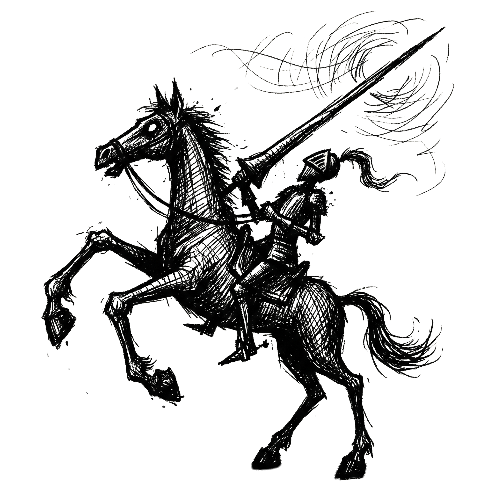
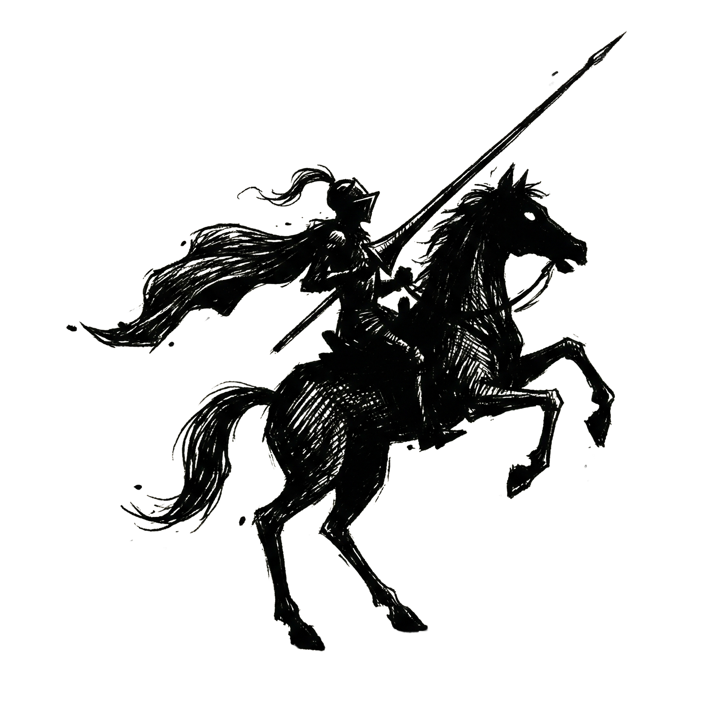
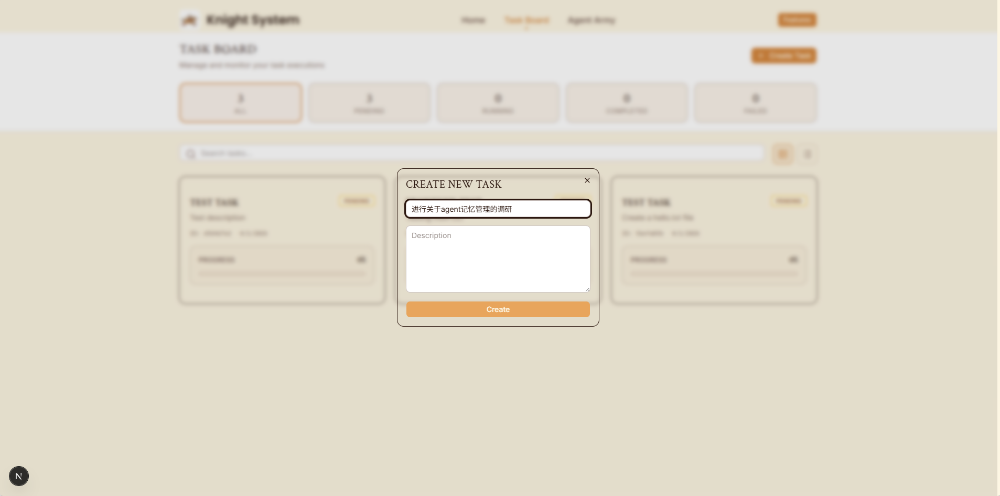
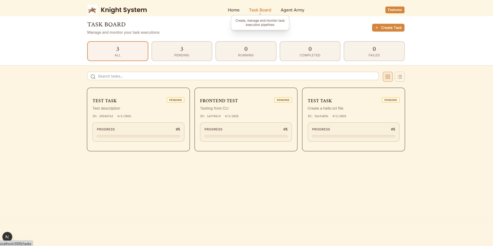
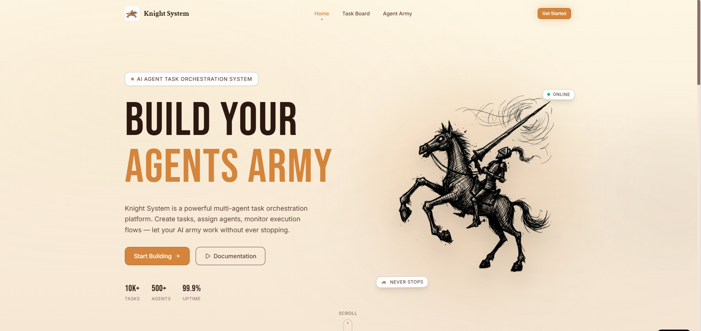
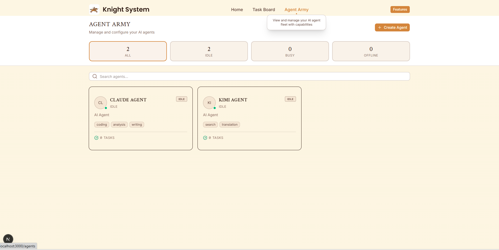

<p align="center">
  
</p>

<h1 align="center">Build Your Own Agent Army</h1>

<p align="center">
  <strong>Knight System — Local AI Agent Cluster Orchestrator</strong>
</p>

<p align="center">
  
</p>

<p align="center">
  <a href="README.zh-CN.md">简体中文</a> •
  <a href="#design-philosophy">Design Philosophy</a> •
  <a href="#workflow">Workflow</a> •
  <a href="#quick-start">Quick Start</a>
</p>

---


## What is Knight System?

**Knight System** is a local, engineering-optimized task orchestrator designed to identify, drive, and manage production-grade AI agents deployed on your own machine. It transforms scattered local agents into a unified, collaborative cluster—enabling a single person to command an army of agents to solve complex problems that exceed the capability of any single tool.

Think of it as the missing command layer between you and the powerful agents already running in your terminal (Claude Code, Kimi Code, Codex, and more). Knight does not redefine the agent itself; it redefines how agents are orchestrated.

---

## Design Philosophy

The core mission of Knight System is to **maximize the problem-solving power of local AI agent clusters** and **maximize the efficiency of a single operator managing that cluster**.

We address two critical gaps in today's ecosystem:
1. **Low engineering optimization** in existing multi-agent frameworks (e.g., OpenClaw-like approaches).
2. **Hard complexity ceilings** in single commercial agents like Claude Code when facing large, ambiguous tasks.

**We do not define rigid scenarios. We do not rewrite agents.**  
Instead, we focus purely on the engineering layer that makes agents work together at scale:

1. **AI Self-Starting & Driving** — The system autonomously decomposes goals, schedules subtasks, and delegates to the right agent without constant human babysitting.
2. **State & Memory Architecture** — A robust, compressed memory and state system that preserves context across long-running, multi-step workflows.
3. **Trial-and-Error & Pipeline Engineering** — Built-in retry loops, failure recovery, and iterative evaluation pipelines that let agent clusters explore, fail, learn, and converge on high-quality outputs.
4. **Active Learning** — The system continuously improves its planning and delegation strategies from execution history.
5. **Maximum Cluster Efficiency** — Intelligent load balancing, task parallelism, and agent selection ensure every agent in your cluster is utilized optimally.

> **In short:** Knight takes the best production agents already optimized by their vendors, re-arms them with superior coordination, memory, and trial-and-error infrastructure, and lets you outsource the heavy lifting of task management to the system itself.

---

## Key Capabilities

### 1. Re-Arm Your Existing Agents
Knight directly calls and drives the powerful agents already installed on your machine. Rather than building yet another agent from scratch, we treat Claude Code, Kimi Code, Codex, and others as specialized workers. Knight simulates the way a human expert would open a terminal window, assign a subtask, collect the result, evaluate it, and assign the next step—except it does this autonomously, in parallel, and at machine speed.

### 2. Intelligent Task Decomposition & Planning
Given a high-level goal, Knight automatically breaks it into an engineering pipeline, assigns subtasks to the most suitable agents, and iteratively evaluates progress. Human feedback is requested only at the most valuable inflection points.

### 3. Memory & State Management
A purpose-built memory layer compresses and surfaces the right context at the right time. Long-running projects do not lose coherence; previous attempts, partial results, and learned patterns are preserved and reused.

### 4. Engineering Best Practices by Default
Knight evolves by adopting robust software engineering patterns: structured task graphs, dependency management, health checks, rollback mechanisms, and observability—so that agent collaboration is reliable, not fragile.

### 5. One-Click Deployment & Minimal UI
A radically simple web frontend gives you two pages and nothing more:
- **Tasks Page** — Create missions and watch execution status in real time.
- **Agent Queue Page** — See which local agents are detected, available, and busy.

Inspired by gateway-management designs like OpenClaw, Knight enables convenient multi-endpoint control with minimal setup.

---

## Workflow



1. **Receive Task Input**  
   You provide a natural-language goal and optional constraints. That is all.

2. **Auto-Split & Plan**  
   Knight analyzes the goal, constructs an execution plan, and breaks it into agent-sized subtasks. It asks for human feedback only when ambiguity would materially affect the outcome.

3. **Deploy the Agent Cluster**  
   Knight launches and directly calls the local agents installed on your machine, feeding each one the precise context it needs.



4. **Iterate, Evaluate, Update**  
   Results are collected, evaluated against quality criteria, and the plan is updated. Failed steps are retried or rerouted. The loop continues until the output meets the defined standard.

5. **Deliver High-Quality Output**  
   The final result is synthesized, formatted, and presented—with full visibility into every step of the process.

---

## Scenarios

Knight excels wherever complexity outstrips the capacity of a single agent:

- **Research & Investigation** — Multi-source data gathering, synthesis, and report generation.
- **Software Development** — Large-scale refactoring, cross-module feature implementation, and architectural design.
- **Complex Design** — Systems that require iterative exploration, comparison of alternatives, and detailed documentation.

---

## Frontend Preview



The web interface is designed for ultimate simplicity:

- **Task Page** — Publish missions, monitor live execution, inspect logs, and review outputs.
- **Agent Queue Page** — View all locally detected agents, their capabilities, and current availability.

No clutter. No unnecessary dashboards. Just the two things you actually need.



---

## Quick Start

### Prerequisites

- Python 3.12+
- Node.js 18+ (for the frontend)
- One or more local AI agents installed (e.g., Claude Code, Kimi Code)

### Install & Launch

```bash
# Clone the repository
git clone https://github.com/firefly-hefeng/knight.git
cd knight

# Install Python dependencies
pip install -r api/requirements.txt

# Install frontend dependencies
cd web && npm install && cd ..

# Start both gateway and web frontend
python3 launch.py both
```

Visit `http://localhost:3000` to open the Task Page and begin building your agent army.

---

## Architecture at a Glance

```
┌─────────────────────────────────────────┐
│         Knight Web Frontend             │
│    (Next.js · Tasks · Agent Queue)      │
└─────────────────┬───────────────────────┘
                  │ HTTP / WebSocket
┌─────────────────▼───────────────────────┐
│         Knight API Gateway              │
│   (Unified entry · Auth · Routing)      │
└─────────────────┬───────────────────────┘
                  │
┌─────────────────▼───────────────────────┐
│           Knight Core                   │
│  ┌─────────┐ ┌─────────┐ ┌──────────┐  │
│  │ Planner │ │ Memory  │ │ Pipeline │  │
│  └─────────┘ └─────────┘ └──────────┘  │
│  ┌─────────┐ ┌─────────┐ ┌──────────┐  │
│  │ Agent   │ │ State   │ │ Observer │  │
│  │ Pool    │ │ Manager │ │          │  │
│  └─────────┘ └─────────┘ └──────────┘  │
└─────────────────┬───────────────────────┘
        ┌─────────┴─────────┐
        ▼                   ▼
   ┌─────────┐         ┌─────────┐
   │ Claude  │         │  Kimi   │
   │  Code   │         │  Code   │
   └─────────┘         └─────────┘
```

---

## License

MIT License — see [LICENSE](LICENSE) for details.

---

<p align="center">
  <strong>Everyone builds their own agent army.</strong><br/>
  
</p>
